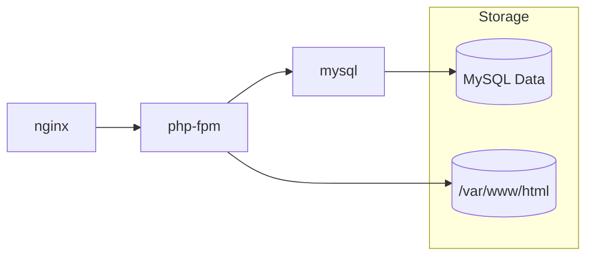

# iaas-webhosting

Demo IaaS-style web hosting using Docker Compose to simulate infrastructure components (VM, network, storage) with containers.

## Architecture

nginx (web) -> php-fpm (app) -> mysql (db)

## Deployment

1. Copy `.env.example` to `.env` and edit credentials/ports.
2. Run `./deploy.sh` to build and start the stack.
3. Visit http://localhost:${NGINX_PORT:-8080}

## What this demonstrates

- Packaging infrastructure components as services
- Using environment variables for configuration
- Simple web app deployment on simulated IaaS
