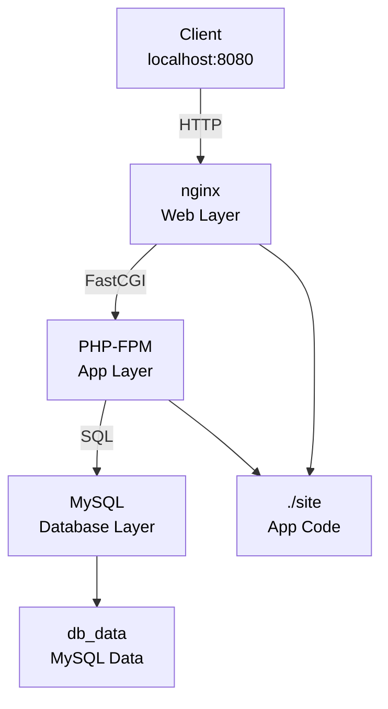

# iaas-webhosting

Demo IaaS-style web hosting using Docker Compose to simulate infrastructure components (VM, network, storage) with containers.

## Architecture

**Request Flow**: Client → nginx (web layer) → PHP-FPM (app layer) → MySQL (database layer)



**Data Flow**:
- Client → nginx on port 8080
- nginx → PHP-FPM via FastCGI
- PHP-FPM → MySQL for queries
- Volumes: ./site (shared code), db_data (persistent data)

## Deployment

1. Copy `.env.example` to `.env` and edit credentials/ports if needed.
2. Run `./deploy.sh` to build and start the stack.
3. Visit http://localhost:${NGINX_PORT:-8080}
4. Explore the application:
   - **Home**: http://localhost:8080 (system info and DB status)
   - **Blog Posts**: http://localhost:8080/posts.php (sample data from MySQL)

## What this demonstrates

- Packaging infrastructure components as services (IaaS model)
- Using environment variables for configuration (multi-environment support)
- Persistent data storage with Docker volumes
- Health checks for service orchestration
- Multi-tier application deployment (web, app, database)
- Container networking and inter-service communication

## Docker Compose Services

### MySQL (Database Layer)
- **Image**: mysql:8.0
- **Port**: 3306 (configurable via `MYSQL_PORT`)
- **Volume**: `db_data` (persistent storage)
- **Health Check**: mysqladmin ping
- **Init Script**: `./init/01-init.sql` (creates schema and sample data)

### PHP-FPM (Application Layer)
- **Image**: Custom Dockerfile (php:8.1-fpm + pdo_mysql)
- **Port**: 9000 (internal, not exposed)
- **Volume**: `./site` (application code)
- **Depends On**: MySQL (waits for health check)
- **Health Check**: PHP availability check

### Nginx (Web Layer)
- **Image**: nginx:stable
- **Port**: 8080 (configurable via `NGINX_PORT`)
- **Volume**: `./site` (read-only), logs volume
- **Depends On**: PHP (waits for health check)
- **Config**: `./nginx/default.conf` (FastCGI proxy to php-fpm)
- **Health Check**: HTTP GET to root path

## Environment Variables

Edit `.env` to customize deployment:

```env
NGINX_PORT=8080              # External web port
PHP_FPM_PORT=9000            # PHP-FPM port (internal use)
MYSQL_PORT=3306              # MySQL port
MYSQL_ROOT_PASSWORD=changeme # MySQL root password
MYSQL_DATABASE=iaas_demo     # Database name
MYSQL_USER=iaasuser          # Application user
MYSQL_PASSWORD=iaaspass      # Application password
```

## Quick Start Commands

**Start the stack:**
```bash
./deploy.sh
# or manually
docker compose up -d --build
```

**View logs:**
```bash
docker compose logs -f
docker compose logs -f php
docker compose logs -f db
```

**Access services:**
```bash
# Test MySQL
docker exec -it iaas-webhosting-db-1 mysql -uroot -pchangeme iaas_demo

# SSH into PHP container
docker exec -it iaas-webhosting-php-1 bash

# Test PHP-FPM
docker exec -it iaas-webhosting-php-1 php -v
```

**Stop the stack:**
```bash
docker compose down
```

**Stop and remove volumes (reset data):**
```bash
docker compose down -v
```

## Docker Networking

The compose file defines implicit networking:
- **Network Name**: `iaas-webhosting_default` (auto-generated)
- **Service DNS**: Services resolve by container name (e.g., `mysql:3306` from PHP)
- **Volume Management**:
  - `db_data`: MySQL data persistence
  - `nginx_logs`: Nginx access/error logs
  - `./site`: Bind mount for PHP application code (live reload)

## IaaS Concepts Demonstrated

- **Infrastructure as a Service**: Containers simulate VMs providing compute, storage, and networking
- **Service Discovery**: Services communicate via DNS names (docker internal DNS)
- **Orchestration**: Docker Compose manages service startup order and health checks
- **Isolation**: Network and filesystem isolation between services
- **Configuration Management**: Environment variables drive multi-environment deployments
- **Scalability**: Services can be scaled independently (e.g., `docker compose up -d --scale php=3`)

## Troubleshooting

**Port already in use:**
```bash
# Change in .env
NGINX_PORT=8081  # Use different port
docker compose down && docker compose up -d
```

**Database won't connect:**
```bash
# Check MySQL logs
docker compose logs db

# Verify health check
docker compose ps
# If "db" shows unhealthy, check password and port
```

**Changes to index.php not showing:**
```bash
# Clear browser cache or use incognito mode
# Volume bind mount is live; no restart needed
```

## Future Enhancements

- Add Redis for caching
- Add Adminer for database management UI
- Add backups/restore scripts
- Add SSL/TLS (nginx reverse proxy)
- Kubernetes migration guide
